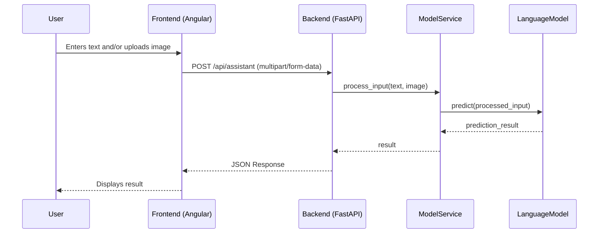

# Architecture

This document outlines the high-level architecture, data flow, and sequence of operations for the Multi-Modal Assistant application.

## High-Level Architecture

The application follows a client-server architecture, composed of two main components:

1.  **Frontend:** A single-page application (SPA) built with Angular. It provides the user interface for text input and image uploads. It runs entirely in the user's web browser.

2.  **Backend:** A Python server built with the FastAPI framework. It exposes a RESTful API that the frontend consumes. It is responsible for processing user inputs, interacting with the multi-modal machine learning model, and returning the results.

### Components

-   **Frontend (Angular)**
    -   `QueryInputComponent`: Handles text-based user queries.
    -   `ImageUploadComponent`: Handles image uploads.
    -   `AppComponent`: The main component that orchestrates the UI.
    -   **Services:** Handles HTTP communication with the backend API.

-   **Backend (FastAPI)**
    -   **API Endpoints (`/api/assistant`):** Receives and validates incoming requests from the frontend.
    -   **Model Service (`model_service.py`):** Contains the core business logic for processing the inputs (text and images) and interacting with the underlying language model.
    -   **Language Model (e.g., LLaMA):** The machine learning model that processes the multi-modal input and generates a response.
        -   **Model Details:** The application uses moondream, a multi-modal model capable of processing both text and image inputs to generate relevant text responses. The model is designed to understand context from both modalities and provide coherent and accurate outputs.

## Data Flow

1.  The user opens the application in their browser, and the Angular frontend is loaded.
2.  The user enters a text query and/or uploads an image file through the UI.
3.  The frontend application sends the text and image data in a `multipart/form-data` HTTP POST request to the backend's `/api/assistant` endpoint.
4.  The FastAPI backend receives the request. The endpoint extracts the text and image file from the request payload.
5.  The endpoint passes the data to the `Model Service`.
6.  The `Model Service` preprocesses the data and sends it to the machine learning model for inference.
7.  The model processes the input and generates a response.
8.  The `Model Service` receives the response from the model.
9.  The backend API sends the response back to the frontend in JSON format.
10. The frontend application receives the JSON response and displays the result to the user.

## Sequence Diagram

The following diagram illustrates the sequence of interactions between the components.

